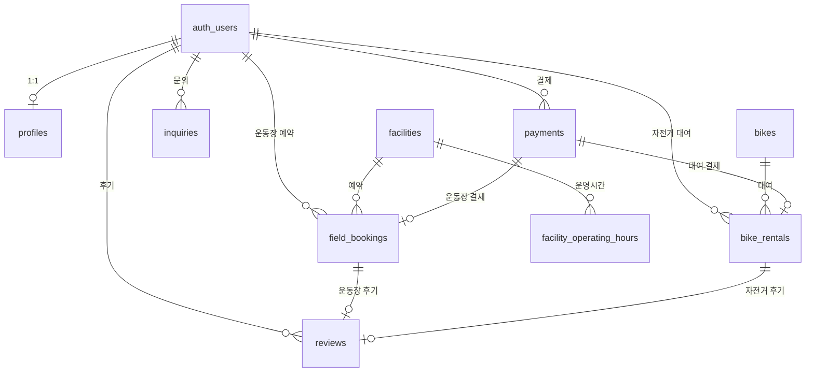

# 행복 나눔 공원 — DB 테이블 설계

Supabase(Postgres) 기준. 회원은 **Supabase Auth** (`auth.users`) 사용.  
기존 `public.users`(타 앱)와 겹치지 않도록 회원 확장 테이블은 **`profiles`** 로 분리했습니다.

---

## ER 다이agram



---

## 테이블 목록 (13개 + RAG 1개)

| # | 테이블 | 용도 |
|---|--------|------|
| 1 | `profiles` | 회원 프로필 (이름, 연락처) |
| 2 | `facilities` | 운동장 4종 마스터 |
| 3 | `facility_operating_hours` | 요일별 운영시간 (2h 슬롯 생성) |
| 4 | `park_holidays` | 공원 휴무일 |
| 5 | `payments` | 결제 공통 |
| 6 | `field_bookings` | 운동장 2시간 예약 |
| 7 | `bikes` | 자전거 3종 마스터 |
| 8 | `bike_rentals` | 자전거 대여·반납·과금 |
| 9 | `reviews` | 후기 |
| 10 | `notices` | 공지사항 |
| 11 | `faqs` | FAQ (+ AI RAG 원본) |
| 12 | `inquiries` | 1:1 문의 |
| 13 | `document_chunks` | AI RAG 벡터 (기존) |

---

## 1. `profiles` — 회원

| 컬럼 | 타입 | 설명 |
|------|------|------|
| id | uuid PK | `auth.users.id` |
| display_name | text | 표시 이름 |
| phone | text | 연락처 |
| created_at | timestamptz | 가입일 |

---

## 2. `facilities` — 운동장 시설

| 컬럼 | 타입 | 설명 |
|------|------|------|
| id | uuid PK | |
| code | text UNIQUE | `soccer` `futsal` `basketball` `badminton` |
| name | text | 축구장, 풋살장, … |
| description | text | 설명 |
| price_per_2h | integer | **2시간 단가 (원)** |
| image_url | text | 이미지 |
| is_active | boolean | 노출 여부 |
| sort_order | smallint | 정렬 |

**시드 (예시 요금)**

| code | name | price_per_2h |
|------|------|--------------|
| soccer | 축구장 | 80,000 |
| futsal | 풋살장 | 50,000 |
| basketball | 농구장 | 40,000 |
| badminton | 배드민턴장 | 30,000 |

---

## 3. `facility_operating_hours` — 운영시간

| 컬럼 | 타입 | 설명 |
|------|------|------|
| facility_id | uuid FK | 시설 |
| day_of_week | 0~6 | 0=일요일 |
| open_time | time | 개장 |
| close_time | time | 폐장 |
| is_closed | boolean | 그날 휴무 |

→ 앱에서 2시간 블록으로 슬롯 생성 (예: 09:00–11:00, 11:00–13:00)

---

## 4. `park_holidays` — 휴무일

| 컬럼 | 타입 | 설명 |
|------|------|------|
| holiday_date | date UNIQUE | 휴무 날짜 |
| reason | text | 사유 |

---

## 5. `payments` — 결제

| 컬럼 | 타입 | 설명 |
|------|------|------|
| user_id | uuid FK | 결제자 |
| amount | integer | 금액 (원) |
| payment_type | text | `field` `bike` `bike_extra` |
| status | text | pending / paid / failed / cancelled / refunded |
| pg_provider | text | PG사 (토스 등) |
| pg_transaction_id | text | PG 거래 ID |
| paid_at | timestamptz | 결제 완료 시각 |

---

## 6. `field_bookings` — 운동장 예약

| 컬럼 | 타입 | 설명 |
|------|------|------|
| user_id | uuid FK | 예약자 |
| facility_id | uuid FK | 시설 |
| booking_date | date | 이용일 |
| slot_start | time | 시작 (예: 09:00) |
| slot_end | time | 종료 (예: 11:00, **2시간**) |
| status | text | pending / paid / cancelled / completed / no_show |
| payment_id | uuid FK | 결제 |
| total_amount | integer | 결제 금액 |

**제약:** `(facility_id, booking_date, slot_start)` UNIQUE → 같은 슬롯 중복 예약 방지

---

## 7. `bikes` — 자전거 종류

| 컬럼 | 타입 | 설명 |
|------|------|------|
| code | text UNIQUE | `single` `tandem` `kids` |
| name | text | 1인용 / 2인용 / 유아용 |
| price_30min | integer | **30분 기본 요금** |
| price_per_10min_extra | integer | **초과 10분당 요금** |
| stock_total | integer | 보유 대수 |

**시드 (예시)**

| code | name | 30분 | 10분 추가 | 재고 |
|------|------|------|-----------|------|
| single | 1인용 | 3,000 | 1,000 | 20 |
| tandem | 2인용 | 5,000 | 1,500 | 10 |
| kids | 유아용 | 2,000 | 500 | 15 |

---

## 8. `bike_rentals` — 자전거 대여

| 컬럼 | 타입 | 설명 |
|------|------|------|
| user_id | uuid FK | 이용자 |
| bike_id | uuid FK | 자전거 종류 |
| started_at | timestamptz | 대여 시작 |
| ended_at | timestamptz | 반납 시각 |
| duration_minutes | integer | 이용 시간 |
| base_amount | integer | 30분 기본 요금 |
| extra_amount | integer | 초과 10분 단위 요금 |
| total_amount | integer | 합계 |
| status | text | active / returned / cancelled |
| payment_id | uuid | 기본 30분 결제 |
| extra_payment_id | uuid | 초과분 추가 결제 (선택) |

**과금 로직 (앱/API)**

```
if duration <= 30:
  total = price_30min
else:
  extra_blocks = ceil((duration - 30) / 10)
  total = price_30min + extra_blocks × price_per_10min_extra
```

---

## 9. `reviews` — 후기

| 컬럼 | 타입 | 설명 |
|------|------|------|
| target_type | text | `field` 또는 `bike` |
| field_booking_id | uuid | 운동장 예약 FK (택1) |
| bike_rental_id | uuid | 자전거 대여 FK (택1) |
| rating | 1~5 | 별점 |
| content | text | 내용 |
| image_urls | text[] | 사진 URL |

---

## 10~12. 고객센터

### `notices` — 공지

| title | content | is_pinned | is_published |

### `faqs` — FAQ

| category | question | answer | sort_order |

→ AI 챗봇 RAG 동기화 시 `faqs` → `document_chunks` 임베딩

### `inquiries` — 1:1 문의

| user_id | category | title | content | status | admin_reply |

---

## 13. `document_chunks` — AI RAG (기존)

FAQ·공지·이용안내 문서 임베딩 저장. 챗봇 응답용.

---

## RLS (Row Level Security)

모든 테이블 **RLS ON** (마이그레이션에 포함).

| 테이블 | 정책 방향 (구현 예정) |
|--------|----------------------|
| facilities, bikes, notices, faqs | 누구나 읽기 |
| profiles, bookings, rentals, payments | 본인만 CRUD |
| inquiries | 본인 작성·조회, 관리자 답변 |
| reviews | 본인 작성, 전체 읽기(visible) |

---

## 마이그레이션 파일

```
supabase/migrations/20260619000000_happy_park_schema.sql
```

Supabase Dashboard **SQL Editor**에 붙여넣거나:

```powershell
supabase db push
```

---

## 기존 Supabase 테이블과의 관계

현재 프로젝트에 `users`, `messages`, `meeting_rooms` 등 **다른 앱 테이블**이 있습니다.  
공원 앱은 **`profiles` + auth.users** 로 분리했으므로 **충돌 없음**.  
같은 Supabase 프로젝트를 쓸지, 공원 전용 새 프로젝트를 쓸지는 선택 사항입니다.

---

## 다음 단계 (구현 시)

1. 마이그레이션 Supabase에 적용  
2. RLS 정책 SQL 추가  
3. Next.js + `@supabase/ssr` Auth 연동  
4. 운동장 예약 API → `field_bookings`  
5. 자전거 반납 API → `bike_rentals` 과금 계산  

원하시면 **RLS 정책 SQL** 또는 **Supabase에 마이그레이션 적용**까지 이어서 진행할 수 있습니다.
